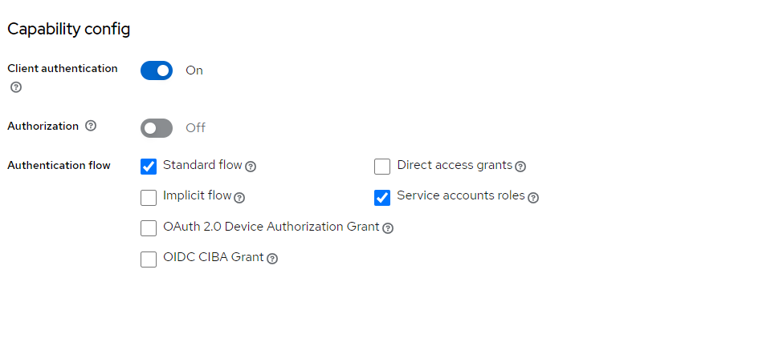

# Keycloak Admin Web Interface

## Description
This project is a Java Web Application (WAR) that serves as an administration interface using servlets and JSP for user management through the Keycloak API. It provides functionalities to list, create, update, and delete users and view clients in the Keycloak repository via REST APIs.

## Table of Contents
- Prerequisites && instalation & download
- Keycloak setup & project configuration
- Usage
- Endpoints

## Prerequisites
 Ensure you have the following prerequisites installed:

- Java Development Kit (JDK) (java 17 preferable)
- Apache Tomcat (Tomcat 8.0)
- Keycloak Installation [Download Keycloak](https://www.keycloak.org/getting-started/getting-started-zip#_download_keycloak)

## Keycloak set up

After completing the installation steps, follow these instructions to set up Keycloak for use with the project.

1. Open your web browser and go to the Keycloak Admin Console. The default URL is [http://localhost:8080](http://localhost:8080).

2. Log in with your administrator credentials.

3. In the Admin Console, create a new realm:
    - Click on the "Master" realm in the top left corner.
    - Select "Add Realm" and give it a name (e.g., `MyRealm`).
    - Click "Create."

4. Create a new client:
    - Within your newly created realm, click on "Clients" in the left sidebar.
    - Click "Create" to add a new client.
    
    - Enter a client ID (e.g., `my-client`) and click "Save."

5. Configure the client settings:
    - In the client settings, go to the "Settings" tab.
    - Enable the Client Athentication 
    - Enable the Service accounts roles
    
    - Click "Save."

6. Assign roles to the client:
    - Navigate to the "Service Account Roles" tab in the client settings.
    - Click At Assign role button
    - Click Flter by clients
    - Add the necessary roles for your application.(for example now you need "manage-client","manage-users","view-users" )
    
    - Click "Save."

7. Update project configurations:
    - Open the `KeycloakConstants.java` file in your project.
    - Set the `REALM`, `CLIENT_ID`, `CLIENT_SECRET`, and other relevant constants with the values corresponding to your Keycloak setup.
    
        - CLIENT_ID : The client id of the client you create at keycloak
        - CLIENT_SECRET : The secret that you will find to the client that you set up to Keycloak
        
        - REALM : The name of thyou Realm
        - KEYCLOAK_URL: The url of your Keycloak server

8. Save the changes and rebuild the project.

In this project we use java servlets and we take the users that is in the realm we can add or delete or update  user 

run keycloak server (in this example we have keycloak 2020) change the posrt of tomcat which default is 8080 as the quarkus default that keycloak is running

and run the project.If you have problem with the starting page try to declare in the path from assembly the webapp folder (eclipse)
